# 苍穹外卖项目介绍

> 苍穹外卖详细教程地址: [黑马程序员最新Java项目实战《苍穹外卖》](https://www.bilibili.com/video/BV1TP411v7v6/)

《苍穹外卖》项目的定位是一款为餐饮企业（餐厅、饭店）定制的软件产品。该项目是一个在线外卖订购系统，顾客可以通过网站或者手机 App 订购餐点。该项目可以提供以下的功能：

用户可以注册和登录账号，浏览餐厅列表，选择菜单，并下单和支付；
餐厅可以注册账号并进行菜单管理，接收和处理订单；
后台管理员可以管理餐厅和用户账号信息，处理订单和投诉，生成销售报表等。
苍穹外卖项目需要具备以下的技术要求：

网站和小程序的设计和开发；
数据库管理系统的设计和实现；
支付系统的接入和开发；
苍穹外卖项目的优点是方便快捷、节省时间，满足了人们日常用餐的需求；缺点是可能存在繁琐的细节和服务质量的不确定性。

## 项目架构
项目的整体架构分为前端和后端，开发模式为前后端分离开发模式：
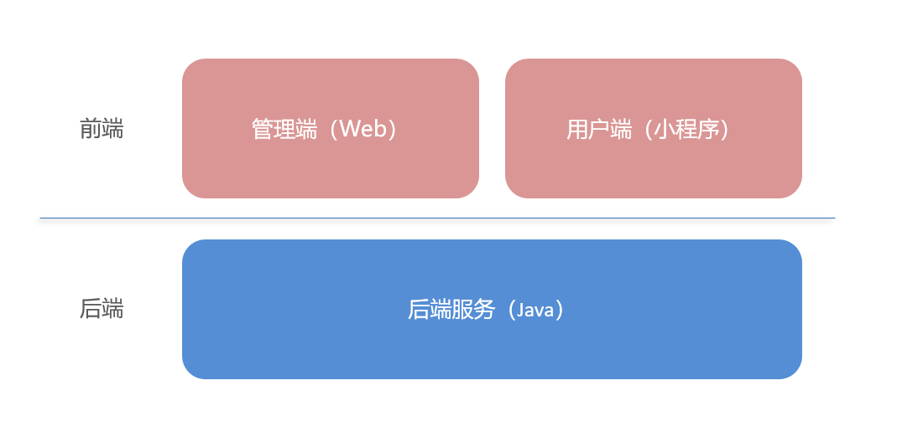
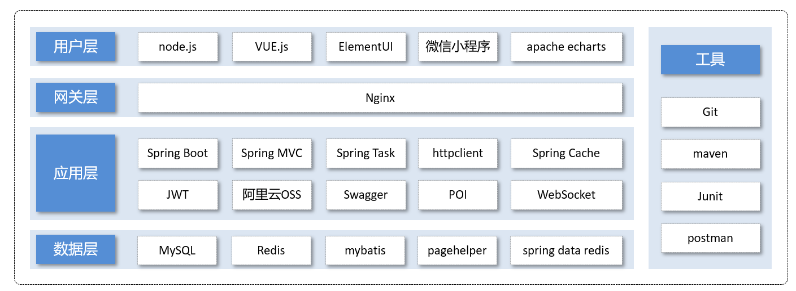

## 功能模块
项目中的业务功能模可划分为管理端和用户端两大模块，模块内业务功能细分如下：
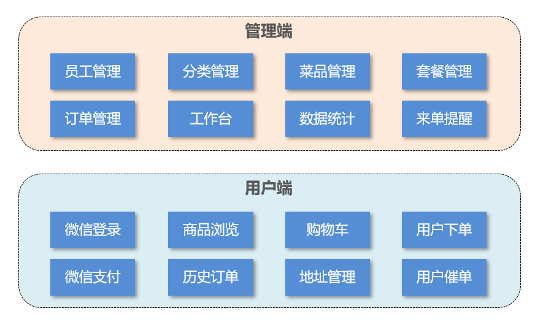

项目管理端截图

|                                                              |                                                              |                                                              |
| ------------------------------------------------------------ | ------------------------------------------------------------ | ------------------------------------------------------------ |
| 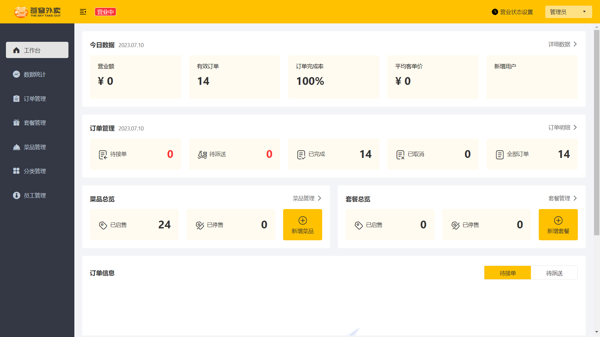 | 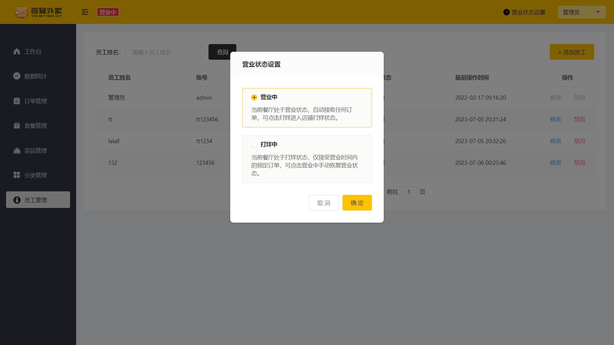 | 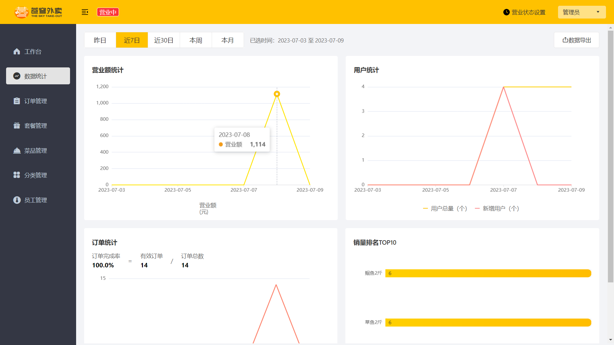 |
|  | 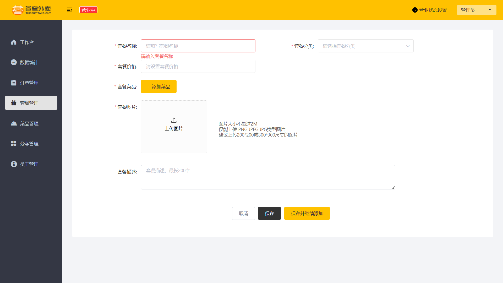 | 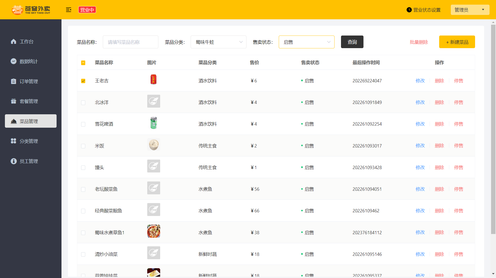 |
| 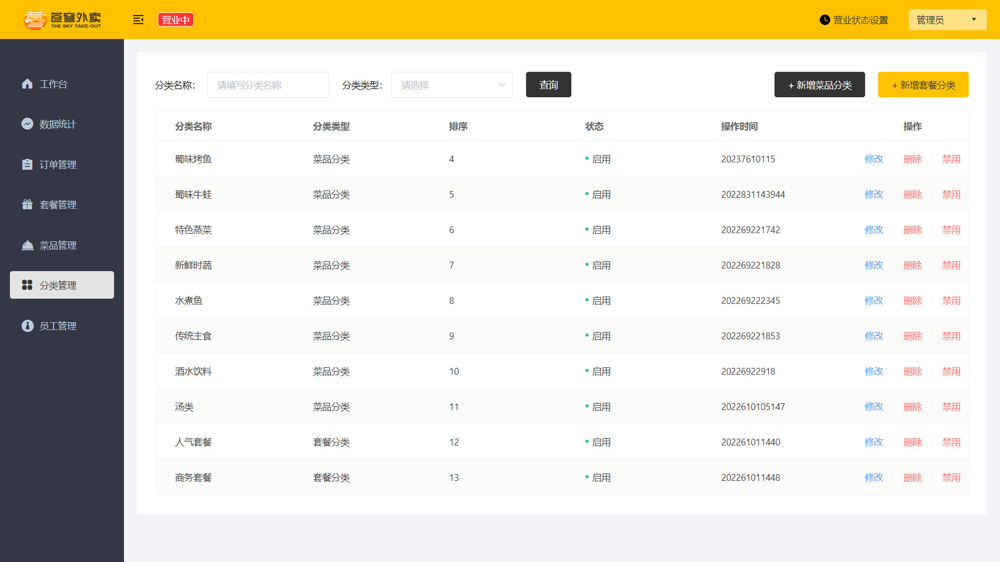 | 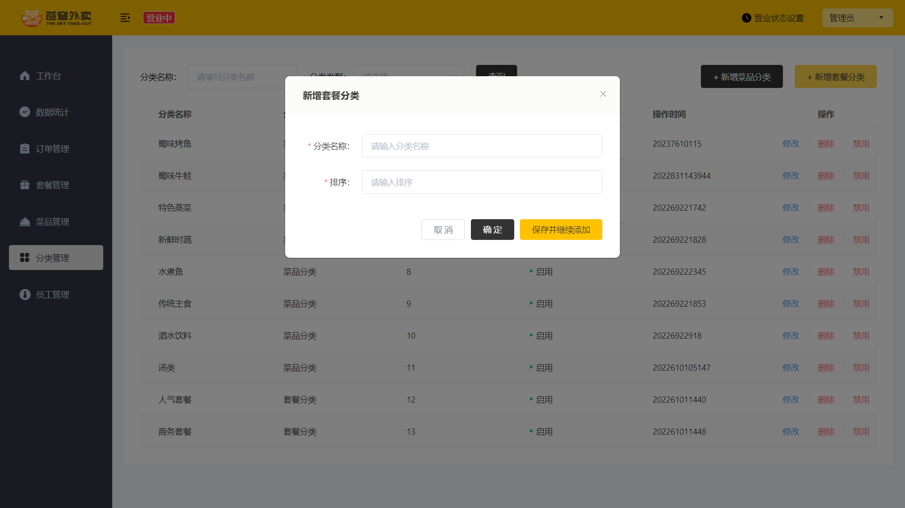 | 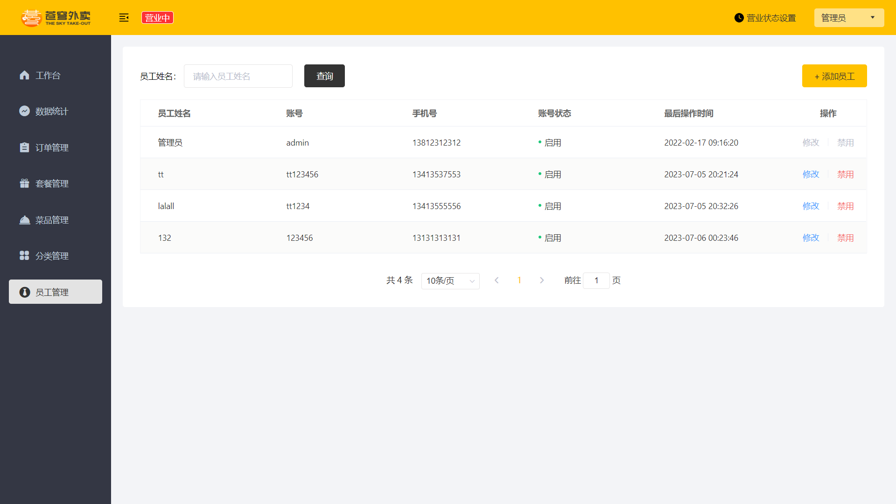 |

### 1). 管理端

餐饮企业内部员工使用。 主要功能有：

| 模块      | 描述                                                         |
| --------- | ------------------------------------------------------------ |
| 登录/退出 | 内部员工必须登录后，才可以访问系统管理后台                   |
| 员工管理  | 管理员可以在系统后台对员工信息进行管理，包含查询、新增、编辑、禁用等功能 |
| 分类管理  | 主要对当前餐厅经营的 菜品分类 或 套餐分类 进行管理维护， 包含查询、新增、修改、删除等功能 |
| 菜品管理  | 主要维护各个分类下的菜品信息，包含查询、新增、修改、删除、启售、停售等功能 |
| 套餐管理  | 主要维护当前餐厅中的套餐信息，包含查询、新增、修改、删除、启售、停售等功能 |
| 订单管理  | 主要维护用户在移动端下的订单信息，包含查询、取消、派送、完成，以及订单报表下载等功能 |
| 数据统计  | 主要完成对餐厅的各类数据统计，如营业额、用户数量、订单等     |

​	

### 2). 用户端

移动端应用主要提供给消费者使用。主要功能有：

| 模块        | 描述                                                         |
| ----------- | ------------------------------------------------------------ |
| 登录/退出   | 用户需要通过微信授权后登录使用小程序进行点餐                 |
| 点餐-菜单   | 在点餐界面需要展示出菜品分类/套餐分类， 并根据当前选择的分类加载其中的菜品信息，供用户查询选择 |
| 点餐-购物车 | 用户选中的菜品就会加入用户的购物车，主要包含 查询购物车、加入购物车、删除购物车、清空购物车等功能 |
| 订单支付    | 用户选完菜品/套餐后，可以对购物车菜品进行结算支付，这时就需要进行订单的支付 |
| 个人信息    | 在个人中心页面中会展示当前用户的基本信息，用户可以管理收货地址，也可以查询历史订单数据 |

# 项目启动

   	

